# InternHub

InternHub is a web platform for students, organizations, and admins to manage internships, vacancies, aptitude tests, and applications.


**Tech stack:** React, TypeScript, Vite, Tailwind CSS, Axios, React Router, Recharts.

**Structure:** 

## 📂 Project Structure

```text
InternHub
├── public/
├── src/
│   ├── api/
│   │   ├── admin/
│   │   ├── auth/
│   │   ├── organization/
│   │   └── student/
│   │
│   ├── assets/
│   │
│   ├── Components/
│   │   ├── Admin/
│   │   ├── Forms/
│   │   ├── models/
│   │   ├── Organization/
│   │   └── Students/
│   │
│   ├── constants/
│   │  
│   │
│   ├── hooks/
│   │
│   ├── images/
│   │   ├── admin/
│   │   ├── organization/
│   │   └── student/
│   │
│   ├── Layout/
│   │   ├── Header.tsx
│   │   ├── LandingPage.tsx
│   │   ├── MainAdminDashboard.tsx
│   │   ├── MainOrganizationDashboard.tsx
│   │   ├── MainUserDashboard.tsx
│   │   ├── NotFound.tsx
│   │   └── Sidebar.tsx
│   │
│   ├── lib/
│   │   └── axios.ts
│   │
│   ├── Pages/
│   │   ├── AdminD/
│   │   ├── Forms/
│   │   ├── landing/
│   │   ├── OrganizationDashboard/
│   │   └── UserDashboard/
│   │
│   ├── App.css
│   ├── App.tsx
│   ├── index.css
│   └── main.tsx
│
├── .env
├── .gitignore
├── eslint.config.js
├── index.html
├── package.json
├── package-lock.json
├── README.md
├── tsconfig.app.json
├── tsconfig.json
├── tsconfig.node.json
└── vite.config.ts
```


**Quick start**

Install and run locally:

```bash
npm install
npm run dev
# build for production
npm run build
# preview production build
npm run preview
```
# Application Screenshots

## 👨‍💼 Admin

### Dashboard
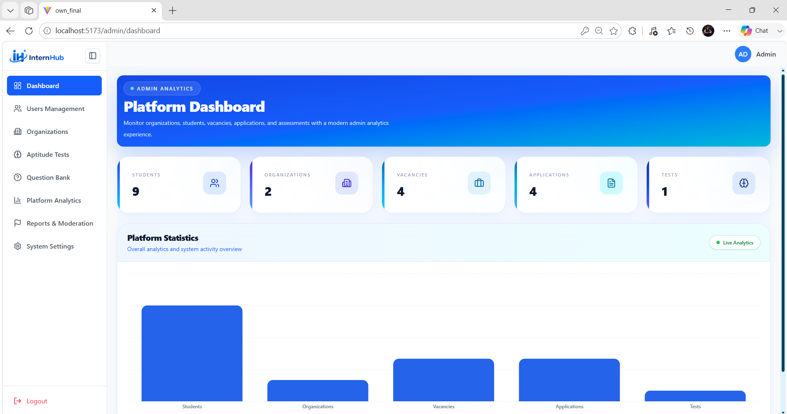

| Manage Students | Manage Organizations |
|-----------------|----------------------|
| 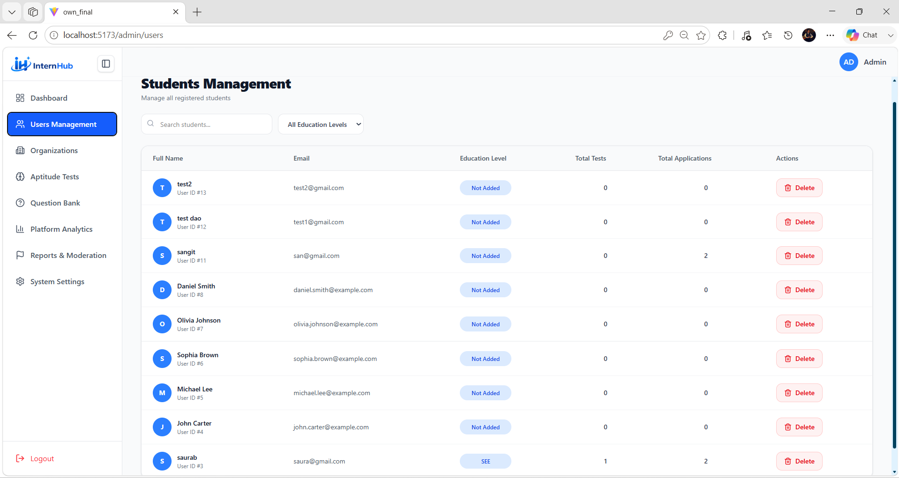 | 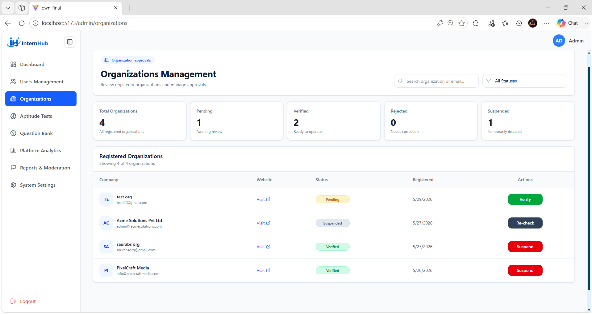 |

| Question Bank | Questions |
|---------------|-----------|
| 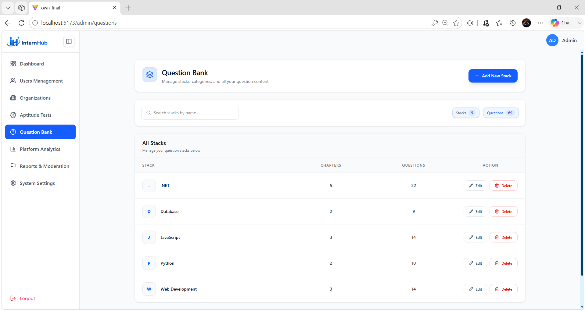 | 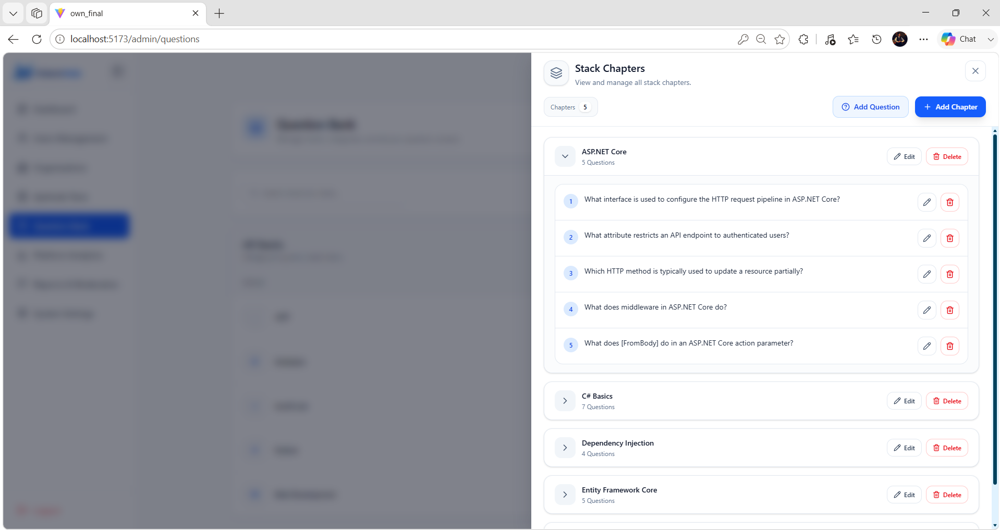 |

---

## 🏢 Organization

### Dashboard
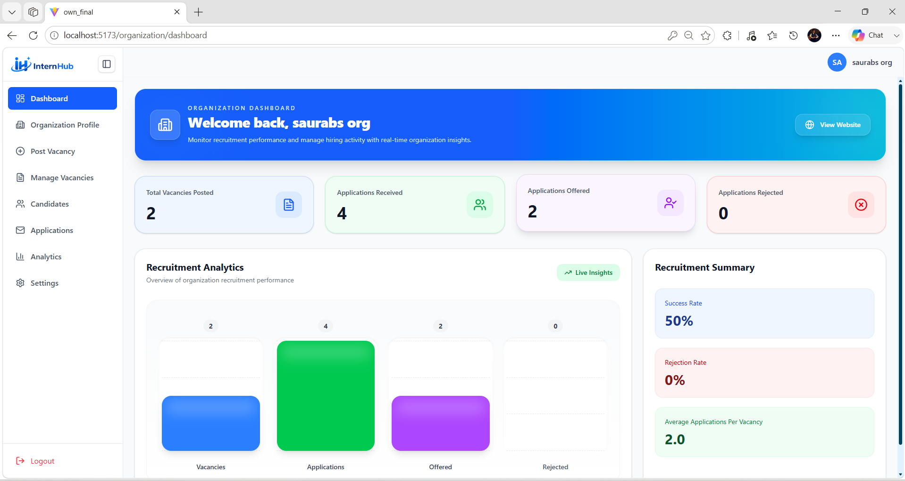

| Post Vacancy | Manage Vacancies |
|--------------|------------------|
| 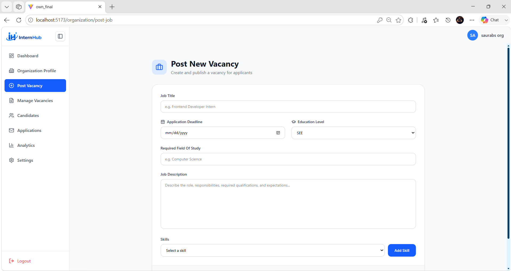 | 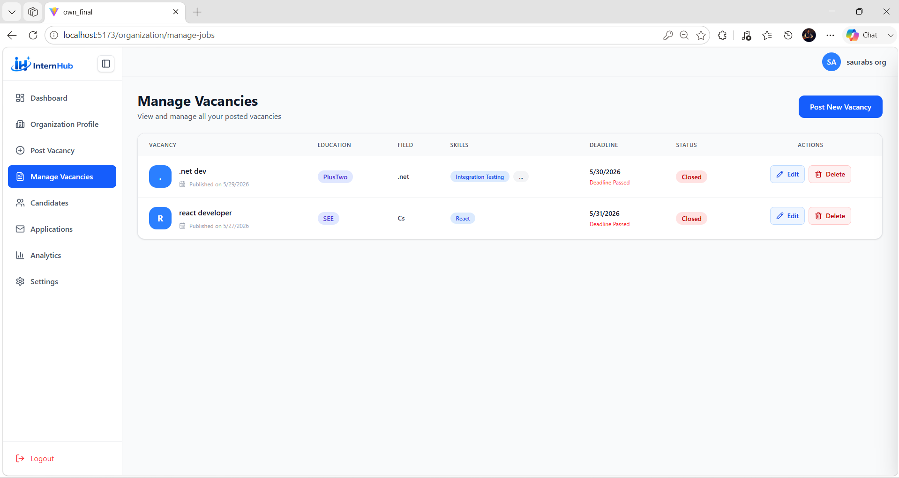 |

| Edit Vacancy | Candidates |
|--------------|------------|
| 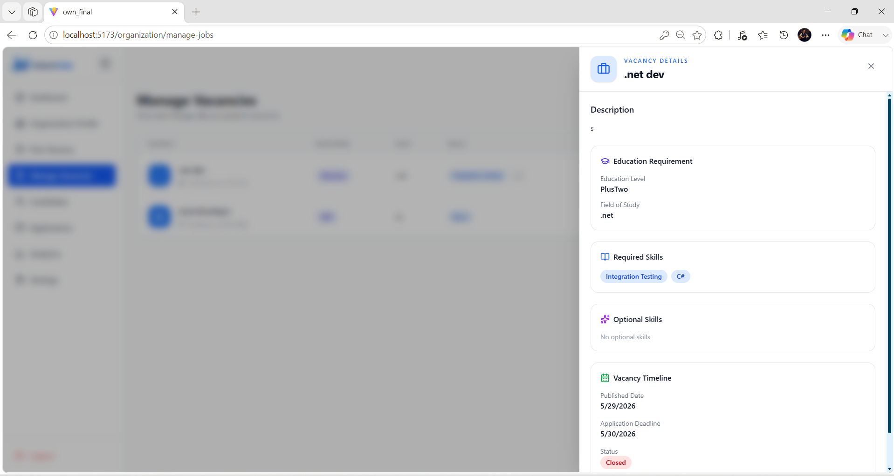 | 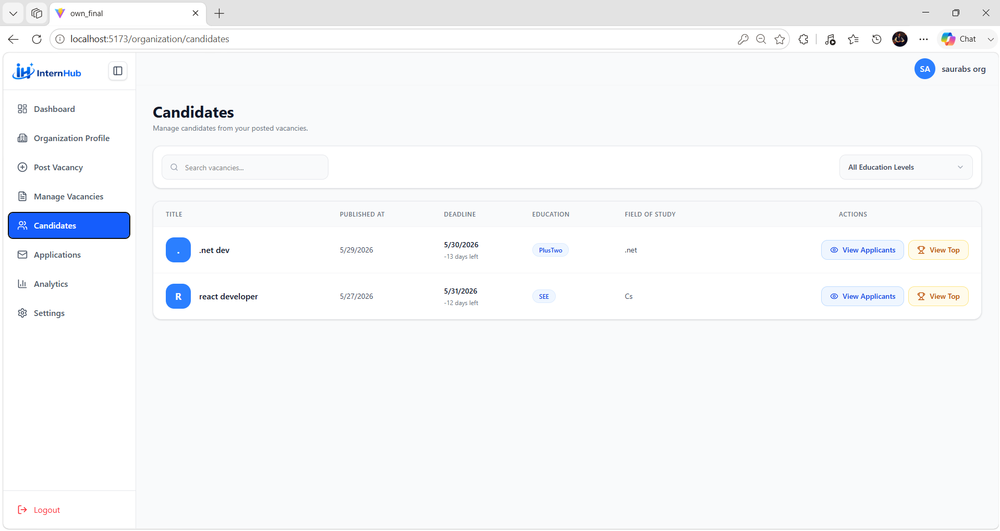 |

---

## 🎓 Student

### Dashboard
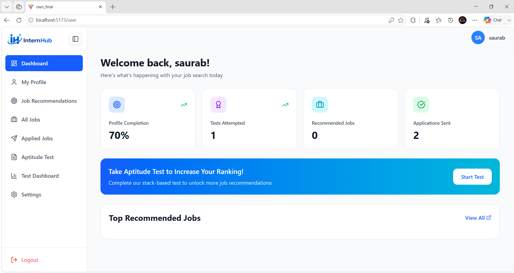

| Jobs | Applied Jobs |
|------|--------------|
| 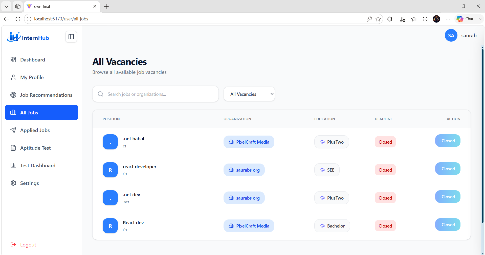 | 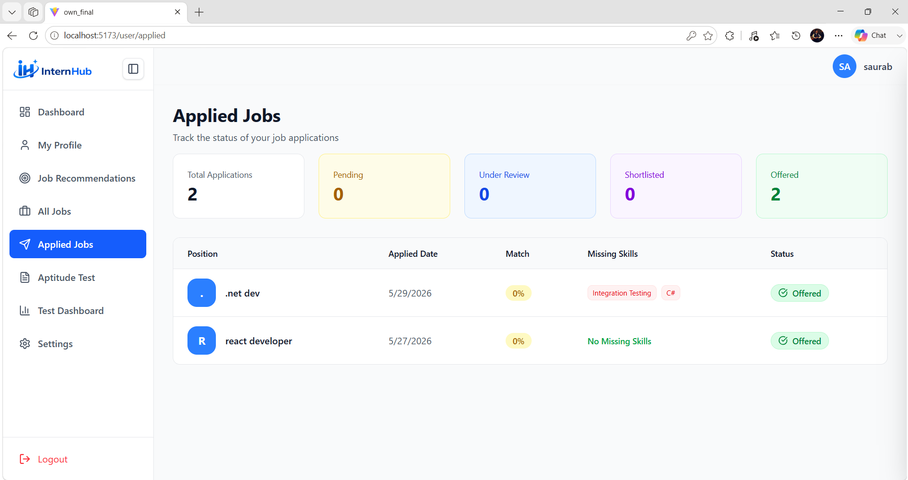 |

| Aptitude Tests | Settings |
|----------------|----------|
| 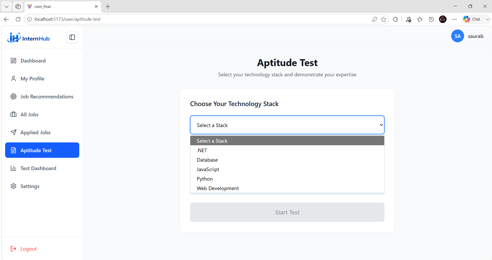 | 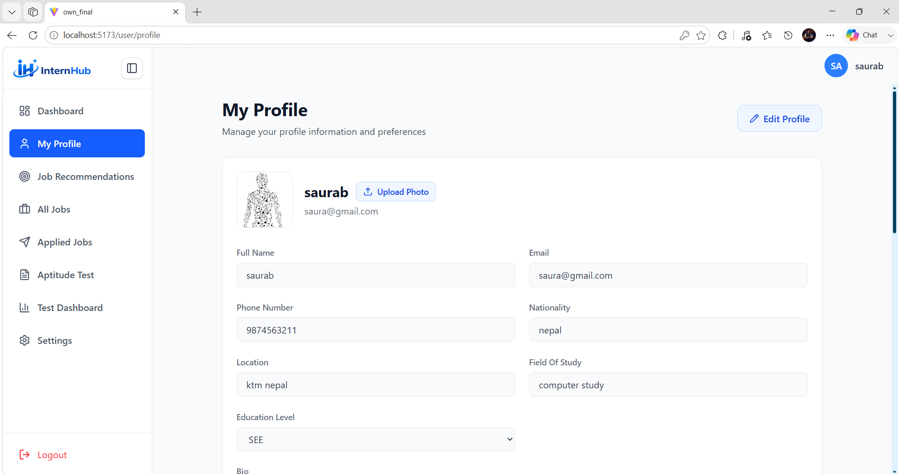 |